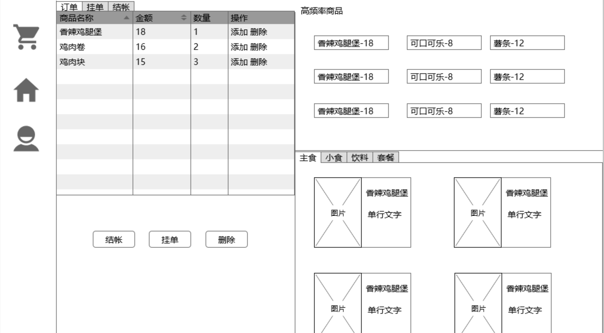

# vue-pos

## Project setup
```
npm install
npm run serve
npm run build
npm run test
npm run lint
```

## knowledge point
1. vue-cli3
   1. vue.config.js
   2. .env (VUE_APP_*)
   3. vue add xxx
   4. build
      1. serve
      ```bash
      npm i -g serve
      # -s 参数的意思是将其架设在 Single-Page Application 模式下
      # 这个模式会处理即将提到的路由问题
      serve -s dist
      ```
      2. `webpack-bundle-analyzer`
         -  `npm run build`看三种状态
      3. **`npm run build -- --report`**
      4. `vue inspect`
2. mockplus draw prototype

3. vue
   1. encapsulate child/parent components
   2. created、mounted
   3. extends
   4. mixins
   5. extends
   6. computed(getter、setter)
   7. custom directive
   8. \$attrs / \$listeners
   9. .sync
   ```javascript
    <TestComponent :title="title" @update:title="title = $event"/>
    <TestComponent :title.sync="title" />
   ```
4. vue-router`vue add router`
   1. route guard
   2. redirect
   3. 路由懒加载(可以扩展到所有组件)`ctrl + shift + p -> coverage -> record`
5. vuex`vue add vuex`
6. axios
   1. created hook to fetch data
   2. axios all
   ```javascript
    axios.all([this.getOftenGoods(), this.getTypeGoods()]).then(
        axios.spread((acct, perms) => {
          //...
        })
      )
   ```
   1. build tabObjs after sync fetch data from server
   2. encapsulate axios (service.js、request.js)
7. [阿里巴巴矢量图](https://www.iconfont.cn/)
  - **sysmbol**
  - font class
8. element-ui plugin for vue-cli 3
   1. vue add element(commite before install, it will change app.vue、main.js、babel.config.js)
   2. mounted hook to reset el-column height
   3. el-table
      1. scope.row
      2. getSummaries
9. [sm图床](https://sm.ms/)
10. [easy-mock](https://www.easy-mock.com)
11. use sass